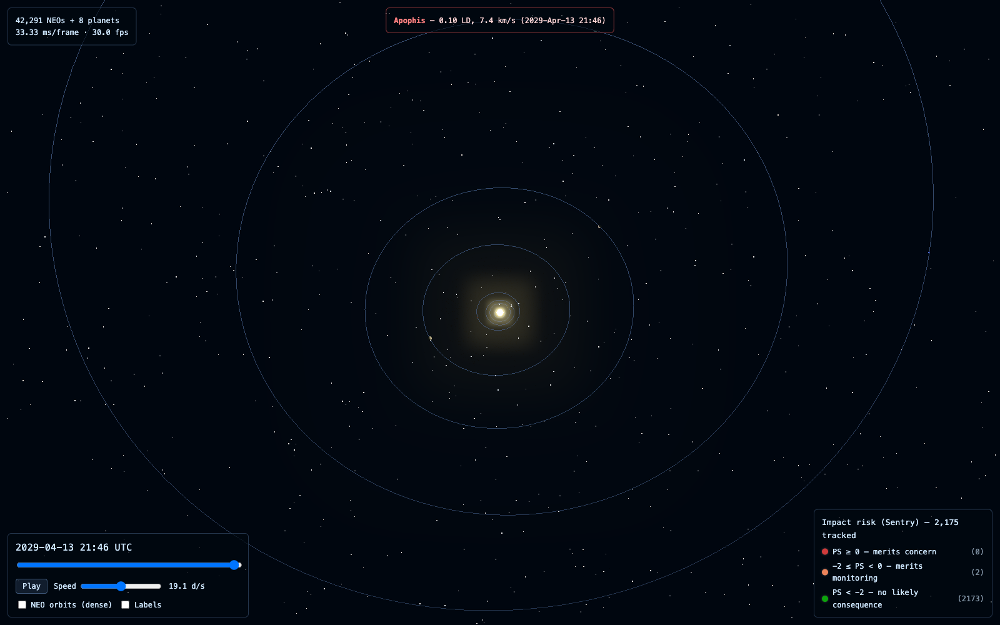
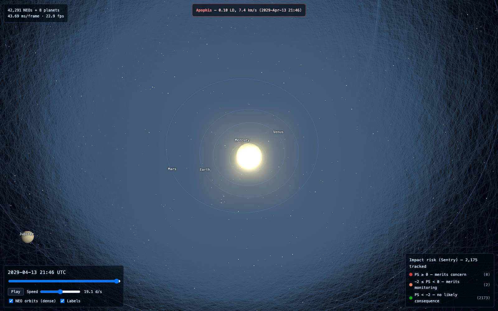
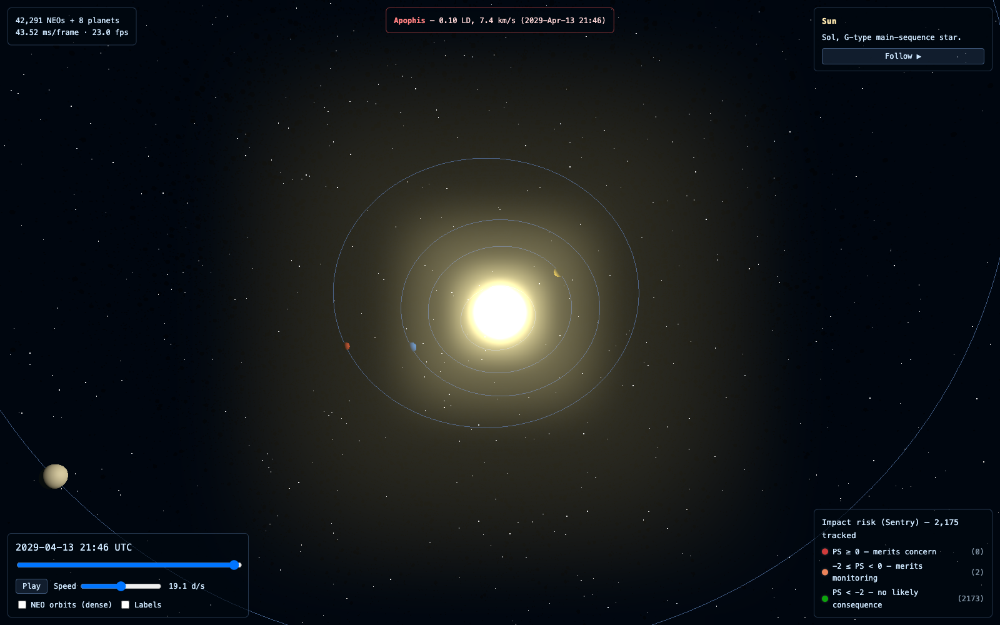
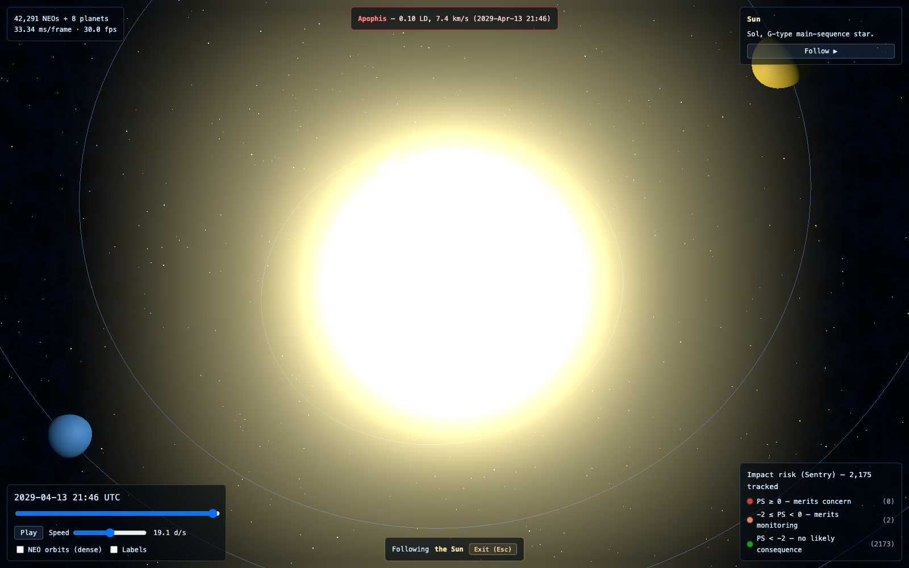

# Apsis — a browser orrery of near-Earth objects

A real-time, client-only visualization of the Sun, the eight planets, and the
full population of known near-Earth objects (NEOs), propagated with real
Keplerian orbital mechanics from live JPL data. No backend: all NASA/JPL data
is fetched once, at build/refresh time, into static JSON that the browser
reads locally.

Built with Vite + TypeScript + three.js, tested with vitest.

**Live:** https://rgcurling.github.io/neo-orrery/

|  |  |
|---|---|
|  |  |
| Default god's-eye view. The red banner is a live close-approach alert (99942 Apophis' 2029 flyby). | Zoomed in with NEO orbit lines and planet labels on — the swarm thins out visibly away from the ecliptic plane. |
|  |  |
| Click any body for its inspector panel; the Sentry risk legend sits bottom-right. | Follow cam locked onto the Sun — selective bloom hits hard up close. |

## Quick start

```bash
npm install
npm run fetch-data   # pulls current NEO elements + close approaches from JPL
npm run dev          # http://localhost:5173
```

`npm run dev` and `npm run build` both expect `public/data/neos.json` and
`public/data/close-approaches.json` to already exist — the app never talks to
JPL directly, so `fetch-data` must run at least once before either. See
[Data](#data) below for how those files stay current.

Other scripts:

```bash
npm test              # vitest — physics correctness (see Propagation math)
npm run build          # tsc -b && vite build -> dist/
npm run preview         # serve the production build locally
```

## Controls

- **Scrubber** — drag to jump to any date in range; dragging pauses playback.
- **Play / Pause**, **Speed** — 1 day/sec to 1 year/sec (exponential slider).
- **NEO orbits (dense)** — toggles all ~42k NEO orbit ellipses; built lazily
  on first use since it's an expensive geometry. Off by default: dense.
- **Labels** — toggles planet name labels.
- **Click** any body (Sun, planet, or NEO) — opens an inspector with its
  orbital elements, and a **Follow** button.
- **Follow** — eases the camera onto that body and tracks it as the solar
  system moves; **Esc** (or the on-screen exit button) eases back to the
  original view.
- Close approaches (within ±1 day of a listed encounter) flash the object red
  and surface its name, miss distance (lunar distances), and relative
  velocity.
- **Impact risk (Sentry)** — the ~2,175 NEOs on JPL's Sentry impact-monitoring
  list render larger and tinted by Palermo Scale risk tier (see the legend,
  bottom-right); the inspector shows Palermo scale, impact probability, and
  potential-impact count for any of them.

## Propagation math

All physics lives in [`src/orbit.ts`](src/orbit.ts), pure functions with no
three.js dependency (`src/orbit.test.ts` exercises them directly). Every
body — planet or NEO — is propagated the same way, from six Keplerian
elements: semi-major axis `a`, eccentricity `e`, inclination `i`, longitude
of ascending node `om` (Ω), argument of perihelion `w` (ω), and mean anomaly
`ma` at some reference epoch.

### Units

Distance in AU, time in Julian years, angles in radians everywhere except at
the JPL data boundary (`scripts/fetch-data.ts` converts degrees to radians
once, at fetch time — nothing downstream ever touches degrees). Working in
AU and Julian years is not just tidy, it eliminates a constant: by Kepler's
third law, for any body orbiting the Sun,

$$T^2 = \frac{4\pi^2}{\mu} a^3$$

and since Earth's orbit is *defined* as `a = 1 AU`, `T = 1 year` in these
units, solving for the Sun's gravitational parameter gives exactly

$$\mu = 4\pi^2 \approx 39.478$$

with no Newtonian constant, no solar mass, and no unit conversion required
anywhere in the propagation code (`orbit.ts` sets `MU = 4 * Math.PI ** 2`
directly from this identity).

### Mean anomaly at time *t*

Mean anomaly advances linearly with time at the body's mean motion `n`,
which — again via Kepler's third law — is

$$n = \sqrt{\frac{\mu}{a^3}} \quad \text{(radians / Julian year)}$$

so position at Julian Date `jd` starts from

$$M(t) = M_0 + n \cdot (t - t_0), \quad \text{wrapped into } [0, 2\pi)$$

where `M₀` and `t₀` are the element set's mean anomaly and epoch. This is
`meanAnomalyAt()` — the only place the JD-to-years conversion
(`/ 365.25`) happens.

### Solving Kepler's equation

Mean anomaly `M` is proportional to time and easy to compute, but it isn't
an angle you can place a body at directly — it's the angle a *fictitious*
body moving at constant angular rate would have. The actual angle, measured
from the focus, is buried inside **Kepler's equation**:

$$M = E - e \sin E$$

where `E` is the *eccentric* anomaly. This is transcendental in `E` — no
closed form — so `solveKepler(M, e)` finds it with Newton-Raphson: seed
`E₀ = M`, then iterate

$$E_{n+1} = E_n - \frac{E_n - e\sin E_n - M}{1 - e\cos E_n}$$

(the denominator is `d/dE (E - e sin E)`) capped at 50 iterations, stopping
once a step moves `E` by less than `1e-10` radians. For every eccentricity
this app actually uses (`e < 1`, checked at fetch time — hyperbolic orbits
are dropped), this converges in well under 10 iterations.

### From eccentric anomaly to a position

With `E` known, the position in the orbital plane has a closed form that
skips computing true anomaly entirely. In the **perifocal frame** (origin at
the Sun/focus, x-axis toward perihelion):

$$x_P = a(\cos E - e), \qquad y_P = a\sqrt{1 - e^2}\, \sin E$$

This is `stateAt()`'s `xp`/`yp` — it's the standard ellipse-with-focus-at-
origin parametrization, and it's exact for any `0 ≤ e < 1`, not an
approximation.

### Rotating into the ecliptic frame

The perifocal frame is tilted and twisted relative to the ecliptic by three
angles — inclination `i`, longitude of ascending node `Ω`, argument of
perihelion `ω` — undone by the standard **3-1-3 Euler sequence**:

$$\vec{r}_{ecl} = R_z(-\Omega)\, R_x(-i)\, R_z(-\omega)\, \vec{r}_{peri}$$

Expanding that matrix product gives the three lines actually in the code:

$$
\begin{aligned}
x &= x_P(\cos\Omega\cos\omega - \sin\Omega\sin\omega\cos i) + y_P(-\cos\Omega\sin\omega - \sin\Omega\cos\omega\cos i) \\
y &= x_P(\sin\Omega\cos\omega + \cos\Omega\sin\omega\cos i) + y_P(-\sin\Omega\sin\omega + \cos\Omega\cos\omega\cos i) \\
z &= x_P(\sin\omega\sin i) + y_P(\cos\omega\sin i)
\end{aligned}
$$

This is the step a wrong sign or transposed matrix breaks silently — the
output is still *an* ellipse, just tilted or spun wrong, and it looks
plausible on screen. Nothing in the visuals catches that; only a numeric
test on a body with real, well-known extremes does (see below).

### Correctness checks

`src/orbit.test.ts`, run with `npm test`:

- **Kepler round-trip** — across a grid of `M` and `e`, solving for `E` and
  recomputing `E - e sin E` returns the original `M` to within `1e-9`.
- **Circular orbit** (`e = 0`) stays at constant radius `a` for all `t`.
- **433 Eros** — a real numbered asteroid with known perihelion/aphelion —
  propagated across a full period at fine steps must stay within its known
  ~1.13–1.78 AU distance band and never leave it. This is the test that
  actually catches a broken rotation sequence: a bad sign flip in the 3-1-3
  matrix still produces a smooth, plausible-looking ellipse, just the wrong
  one, and only a real body's known numeric range exposes that.
- **Earth** returns to its exact starting position after propagating one
  full year.

Planet elements are hardcoded J2000 mean elements (Standish 1800–2050,
[`src/planets.ts`](src/planets.ts)) — constant, no secular rates, which is
the accepted approximation for a visual orrery at this scale.

## Data

`scripts/fetch-data.ts` (`npm run fetch-data`) is the only code in this
project that talks to JPL. It writes static JSON to `public/data/`, which
Vite serves as-is — the browser only ever reads local files.

- **NEO orbital elements** — `ssd-api.jpl.nasa.gov/sbdb_query.api`,
  `sb-group=neo`, fields confirmed live against that API's `info=field`
  endpoint before being hardcoded (see the `SBDB_FIELDS` comment in the
  script). Objects with eccentricity ≥ 1 (hyperbolic/parabolic) or any
  missing element are dropped.
- **Close approaches** — `ssd-api.jpl.nasa.gov/cad.api`,
  `dist-max=10LD&date-min=now&date-max=+1000` (next ~2.7 years, within 10
  lunar distances).
- **Impact risk** — `ssd-api.jpl.nasa.gov/sentry.api` with **no query
  parameters**, which selects the API's "Mode S" one-row-per-object summary
  (`ps_cum`, `ps_max`, impact probability, etc.). This one is a trap: adding
  `all=1` — a natural first guess — actually switches to a *different* mode
  (every individual virtual-impactor record, ~20x more rows, no per-object
  summary fields at all). Confirmed against the live
  [Sentry API docs](https://ssd-api.jpl.nasa.gov/doc/sentry.html) before
  writing the fetch, same as the NEO fields above.

`public/data/*.json` is committed to the repo (not gitignored) and kept
current by a scheduled GitHub Action
([`.github/workflows/refresh-data.yml`](.github/workflows/refresh-data.yml))
that re-runs `fetch-data` weekly and commits the result if it changed. That
commit's push to `main` also triggers a redeploy. Worth knowing: the NEO
file is ~10 MB and mostly rewritten on every refresh (JPL doesn't provide a
diff/delta endpoint), so this trades steady repo growth (~10 MB/week) for
having versioned, always-buildable data with no runtime dependency on JPL
being reachable. If that growth becomes a problem, the alternative is to
stop committing `public/data` and instead have only the deploy workflow
fetch fresh data at build time.

## Deployment

Deployed to GitHub Pages via
[`.github/workflows/deploy.yml`](.github/workflows/deploy.yml) on every push
to `main` (fetches fresh data, builds, publishes `dist/`).

## Architecture

No backend, no runtime API calls from the browser. Two performance rules
that matter at NEO-population scale (tens of thousands of objects):

- All orbit paths are sampled once and merged into a single `LineSegments`
  `BufferGeometry` — never one `Line` per object.
- All NEO bodies share a single `InstancedMesh`; positions are written into
  the instance matrix array every frame (`instanceMatrix.needsUpdate = true`),
  never individual meshes.
